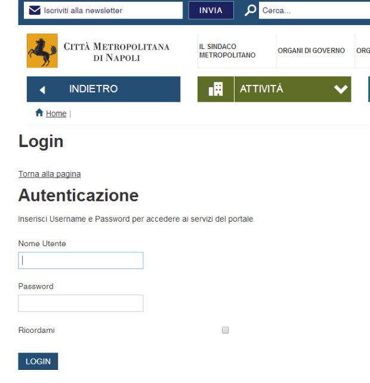
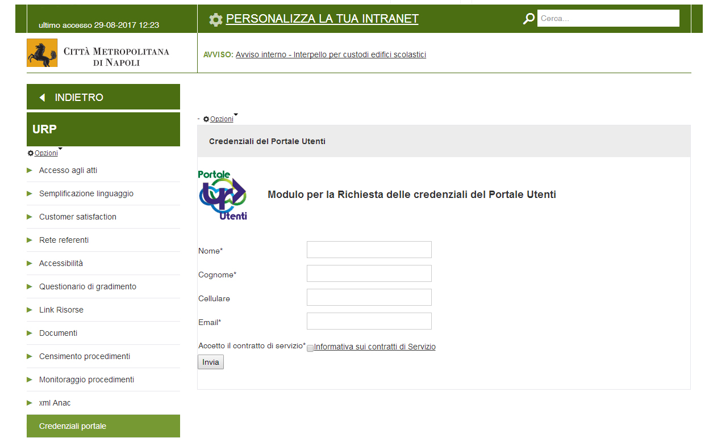
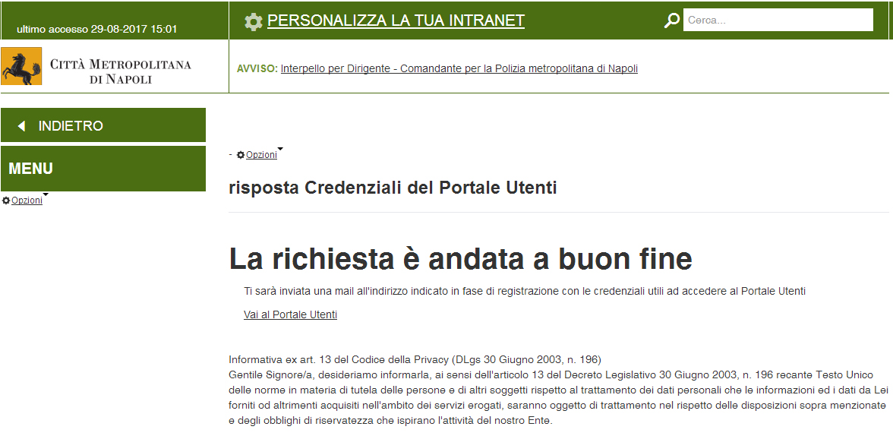
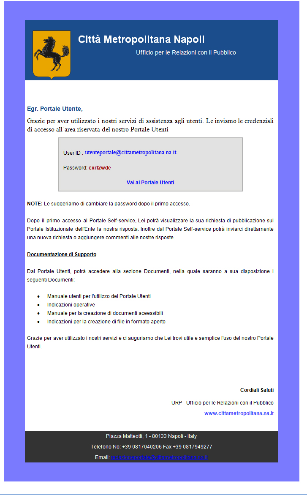
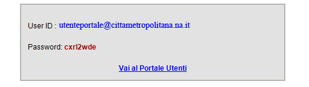
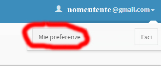
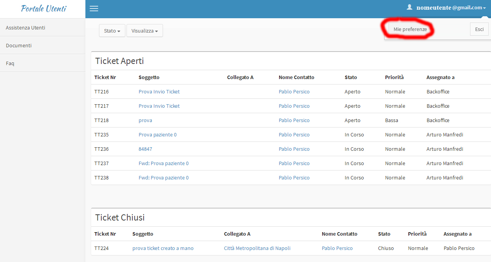
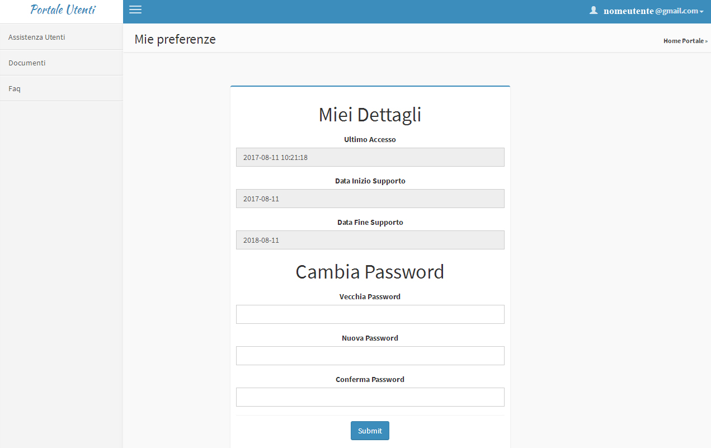
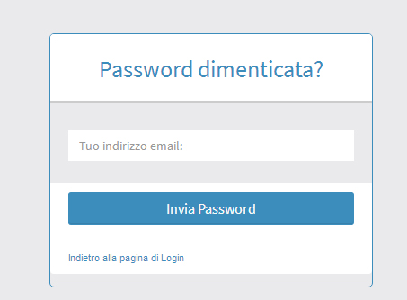
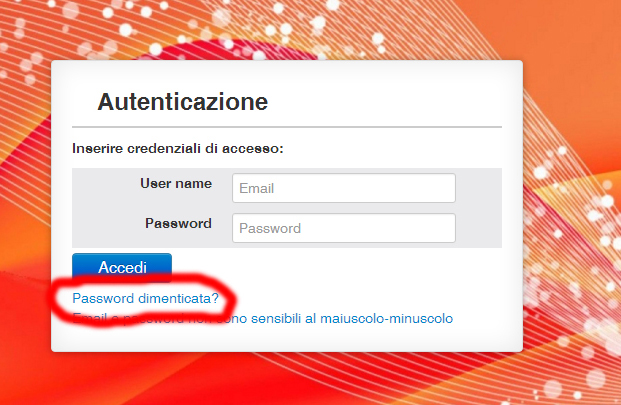

3. Credenziali di accesso
=========================

L’utente interessato ad utilizzare il Portale Utenti deve effettuare la registrazione per ottenere le credenziali di accesso.

3.1 Registrazione al Portale Utenti
-----------------------------------

La registrazione può essere effettuata all’indirizzo http://www.cittametropolitana.na.it/group/intranet/credenziali-portale

previa autenticazione al portale Intranet

|Credenziali intranet Portale Istituzionale Città Metropolitana di Napoli|

Figura 2 – Credenziali Portale Intranet

Il form è raggiungibile anche dall’area **Intranet** del sito istituzionale

alla sezione “\ **Urp”** sotto la voce **“credenziali portale”**

|WebForm registrazione credenziali Portale Utenti|

Figura 3 – Web form richiesta credenziali

Una volta completato il form e inviati i dati verrete reindirizzati su una pagina che vi confermerà l’avvenuta iscrizione

|corretto invio dati per registrazione al Portale Utenti|

Figura 4 – Esito positivo richiesta credenziali

3.2 Ricezione Credenziali
-------------------------

Dopo l’invio dei dati, verrà immediatamente recapitata una e-mail all’indirizzo indicato, con le credenziali utili per l’accesso al portale

|Email invio credenziali Portale Utenti|

Figura 5 – Email credenziali

dall’email si potrà raggiungere direttamente il portale attraverso il link posto in basso “\ **Vai al Portale Utenti**\ ”.

|dettaglio credenziali Portale Utenti e link|

Figura - dettaglio email credenziali portale

3.3 Cambio Password
-------------------

Una volta avuto accesso al portale è consigliato cambiare la password di accesso. In alto a destra sotto la voce recante il vostro indirizzo mail troverete un menù, scegliete la voce **“Mie preferenze”**

|image8|\ |Mie Preferenze Portale Utenti|

Figura - Mie Preferenze e dettaglio

Nella pagina che si aprirà troverete i campi **“vecchia password”** e **“nuova password”** da dover compilare.

|Cambio Password Portale Utenti|

Figura - Cambio Password

3.4 Password dimenticata
------------------------

|image11|\ |Password dimenticata|

Figura - Password dimenticata

Per il recupero della password è necessario cliccare sul link **“password dimenticata?”** che troverete sotto il pannello di inserimento delle credenziali nella home page del portale utenti Da lì verrete reindirizzati su una pagina dove vi verrà chiesto di inserire l’indirizzo email e dopo aver cliccato sul pulsante invia password vi verrà recapitata una nuova password.

